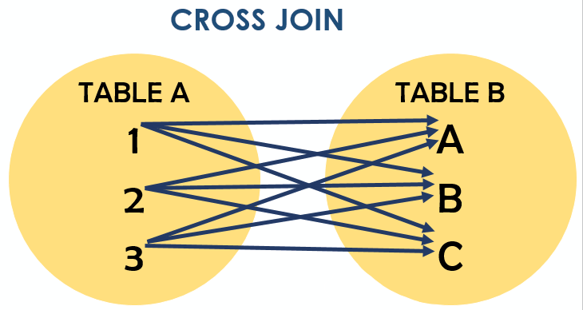

# Знакомство с соединениями JOINS

Соединение между двумя таблицами, где одна имеет первичный ключ, а вторая внешний ключ
на этот первичный ключ.

- `INNER JOIN` - **Внутреннее** соединение. В результирующий набор из левой таблицы попадут только те записи, которые соответствуют ключу в правой таблице
- `LEFT JOIN` - **Внешние** соединения. В результирующий набор из левой таблицы попадут все записи из левой таблицы. 
  Если записям из левой таблицы есть соответствие из правой таблицы, то происходит соединение, как при `INNER JOIN`
- `RIGHT JOIN` - Работает как и `LEFT JOIN`, но в результирующий набор из правой таблицы попадут все записи, а соответствие будет искаться
  по левой таблице.
- `FULL JOIN` - Забираем все записи из левой и правой таблицы. Сопоставляем, если есть совпадение.
  Если данных нет - забиваются `NULL`'ами
- `CROSS JOIN` - Декартово произведение. Каждой записи слева сопоставляются все записи справа.
- `SELF JOIN`

