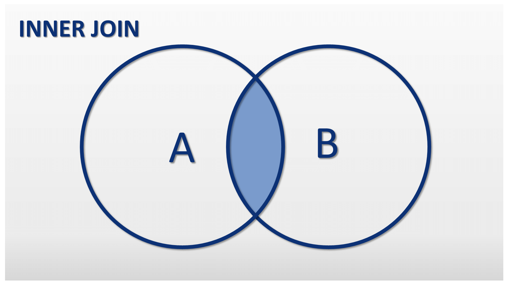

# Соединение INNER JOIN

Оператор SQL `INNER JOIN` формирует таблицу из записей двух или нескольких таблиц. 
Каждая строка из первой (левой) таблицы, сопоставляется с каждой строкой из второй (правой) таблицы, после чего происходит проверка условия. 

Если условие истинно, то строки попадают в результирующую таблицу. В результирующей таблице строки формируются конкатенацией строк первой и второй таблиц.

Оператор SQL `INNER JOIN` имеет следующий синтаксис:

```sql
SELECT
    column_names [,... n]
FROM
    Table_1 INNER JOIN Table_2
ON condition
```

Схематически как происходит соединение:


Объединяем таблицы `products` и `suppliers`
```postgresql
SELECT product_name, suppliers.company_name, units_in_stock
FROM products
INNER JOIN suppliers ON products.supplier_id = suppliers.supplier_id
ORDER BY units_in_stock DESC
```

```postgresql
SELECT category_name, SUM(units_in_stock)
FROM products
INNER JOIN categories ON products.category_id = categories.category_id
GROUP BY category_name
ORDER BY SUM(units_in_stock) desc
LIMIT 5
```

```postgresql
SELECT category_name, SUM(unit_price * units_in_stock)
FROM products
INNER JOIN categories ON products.category_id = categories.category_id
WHERE discontinued <> 1
GROUP BY category_name
HAVING SUM(unit_price * units_in_stock) > 5000
ORDER BY SUM(unit_price * units_in_stock) DESC
```

```postgresql
SELECT order_id, customer_id, first_name, last_name, title
FROM orders
INNER JOIN employees ON orders.employee_id = employees.employee_id
```

```postgresql
SELECT order_date, product_name, ship_country, products.unit_price, quantity, discount
FROM orders
INNER JOIN order_details ON orders.order_id = order_details.order_id
INNER JOIN products ON order_details.product_id = products.product_id
```


```postgresql
SELECT contact_name, company_name, phone, first_name, last_name, title
		order_name, product_name, ship_country, products.unit_price, quantity, discount
FROM orders
JOIN order_details ON orders.order_id = order_details.order_id
JOIN products ON order_details.product_id = products.product_id
JOIN customers ON orders.customer_id = customers.customer_id
JOIN employees ON orders.employee_id = employees.employee_id
WHERE ship_country = 'USA'
```
