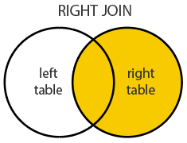

# Соединения LEFT JOIN, RIGHT JOIN

`LEFT JOIN` - просто забирает все записи из **ЛЕВОЙ** таблицы, сопоставляет с **ПРАВОЙ**,
подставляет данные (для **ПРАВОЙ** таблицы), если есть сопоставление по таблице.
Если сопоставления нет, забивает `NULL`


`RIGHT JOIN` - просто забирает все записи из **ПРАВОЙ** таблицы, сопоставляет с **ЛЕВОЙ**,
подставляет данные (для левой таблицы), если есть сопоставление по таблице.
Если сопоставления нет, забивает `NULL`


Заказчики без единого заказа
```postgresql
SELECT company_name, order_id
FROM customers
LEFT JOIN orders ON orders.customer_id = customers.customer_id
WHERE order_id IS NULL
```

Найти работников, на которых нет никаких заказов
```postgresql
SELECT last_name, order_id
FROM employees
LEFT JOIN orders ON orders.employee_id = employees.employee_id
WHERE order_id IS NULL
```
